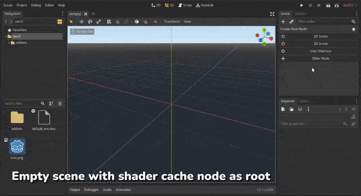

# Shader Cache for Godot 3.x

Shader caching workflow for Godot 3.x


*This is a tool made for my project - [Pingo Adventure](https://s.team/a/2015830)*

## Features

- Works out of the box, with or without script
- Flexible workflow, setup once and update by clicking one button
- [Cover most cases](#covered-cases)
- "Deep caching", recursively caching for all script variables with type of `PackedScene` and all materials lives in animation keyframe from `AnimationPlayer`.

## Installation

1. Install directly from Godot Asset Library

or

1. Download this respository, move `addons/gd-shader-cache` to your `{project_dir}`

2. Enable it from Project -> Settings -> Plugins

or

1. Install with [gd-plug](https://github.com/imjp94/gd-plug), by adding `plug("imjp94/gd-shader-cache")` to `plug.gd`
2. Run install command in shell, `godot --no-window -s plug.gd install `

## Getting Started



1. Create new empty scene with `ShaderCache` node as root.
2. Assign scene path to cache.
3. Click on `Cache Scene Btn` in inspector.
4. Save the scene as `.scn` file(There'no problem with `.tscn`, but it would be slow to load and taking a lot of space).
5. Drop the saved cache scene into the selected scene.
6. Add cache as child to main camera and make sure it is within camera frustum. Scale down as small as possible.

And done! The game scene will always "compile" all cache on loaded.

> In case new material, shader, particles or mesh added to game scene, simply open the saved cache scene and click on `Cache Scene Btn` again to re-generate the cache.

## Advance Usage

This plugin is made to work out of the box for any projects. For small and simple game scene, putting the cache into the scene is the easiest way.

But for larger and complex scene, shader cache can takes lots of time to load and you might want to have control over when to add cache to scene.

`ShadedCacheManager` autoload is provided to allow adding cache into scene through script.

For example, the game scene is loaded asynchronously with a custom load manager:

```gdscript
onready var shader_cache_manager = $"/root/ShaderCacheManager"

# Custom LoadManager finish loading game scene and its cache
func _on_LoadManager_scene_loaded(packed_scene, cache_packed_scene):
    # "Compile" the cache before adding game scene instance to scene tree
    shader_cache_manager.compile(cache_packed_scene) 
    var game = packed_scene.instance()
    scene_root.add_child(game)
```

> `ShaderCacheManager.compile()` will fit cache into current main camera(if not, automatically create one), so you can have the freedom to "compile" the cache at any point of time - right after app started, during splash screen, in the middle of load screen or even after the game scene added to scene tree.

## How it works

It's just an old simple trick that force the renderer to compile the shaders by "flashing" the materials.

### Covered Cases

- `GeometryInstance`, including `material_override`, `material_overlay`, surface material and material embedded to mesh
- `CSGPrimitive`

[Based on u/AlackSunrider's findings](https://www.reddit.com/r/godot/comments/osx0f6/my_very_comprehensive_shader_cache_solution/)

- Transparent material with different `MeshInstance.cast_shadow`
- Particle materials
- MultiMeshInstance(even using same material as MeshInstance)
- MeshInstance with skeleton parent

After countless trials and errors, here's my findings:

- ArrayMesh must be reused
- Particles with non-zero `preprocess`(Best to always set `preprocess` as zero, otherwise, every single particles node works like unique shader)

"Deep caching":

- Materials that lives in keyframes of `AnimationPlayer`
- Recursively caching for all script variables with type of `PackedScene`

> Note: Materials with `local_to_scene` as true, will lost its reference to the original material. The cache will works without any problem, but now the cache has to be re-generated everytime the original material is updated.

## Credits

This solution is based on [godot_shader_cache.gd by @ViniciusMeirelles](https://gist.github.com/ViniciusMeirelles/7ef55b9bfec7f3b5e3448b1a7a63b5ef)
